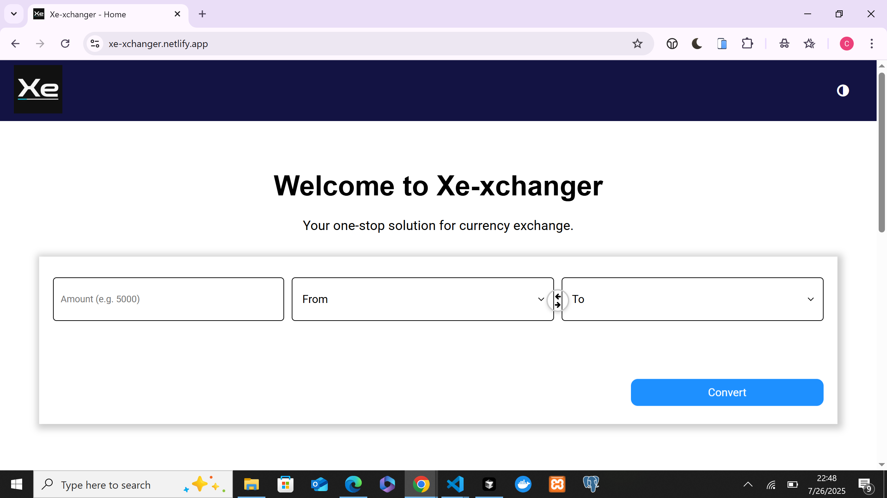

# 💱 Xe Currency Converter Website

A simple and intuitive currency converter that helps users convert values between different world currencies in real-time. Designed with a clean UI and mobile-first approach.

## 🚀 Live Demo

🔗 [View Live Site](https://xe-xchanger.netlify.app/)

## ✨ Features

- 🌍 Convert between 160+ global currencies
- 📈 Real-time exchange rates using a public API
- 💡 Simple, user-friendly interface
- 📱 Fully responsive design for mobile and desktop
- 🧮 Instant calculations

## 🛠️ Tech Stack

- **HTML5** – Markup
- **CSS3** – Styling
- **JavaScript (Vanilla)** – Functionality & API Integration
- **Third Party APIs**: Exchange rate API – [ExchangeRate-API](https://www.exchangerate-api.com/)

## 📸 Screenshots

> 

## ⚙️ Getting Started

To run this project locally:

1. Clone the repo:

   ```bash
   git clone https://github.com/Tomzyofficial/xe-xchanger.git
   cd xe-xchanger

   ```

2. Use **Go Live** extension from your editor to render the page

## How the site works

1. Click the **input** and type in the desired amount

2. Click the **From** drop down menu and select the desired currency to convert from

3. Click the **To** drop down menu and select the desired currency to convert to

4. Click the **Convert** button — and just like that, your conversion is done!

## Future features

- Implement the signin and signup page with a personalised dashboard
